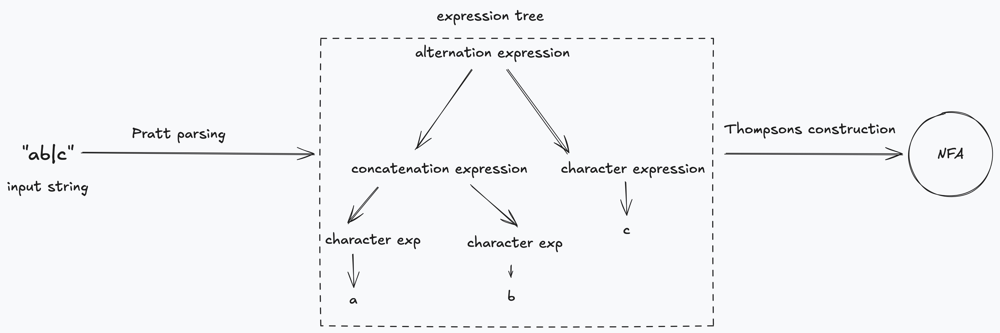

# Go Regex Engine

Learning Go by implementing a regex engine. It is based on NFA construction using methods described by Russ Cox (rswc). See used resources for more information.

The general idea is to create an non-finite state automata (NFA) from an expression tree. The tree is created using Pratt parsing. Each expression in the tree is then converted to a NFA fragment. Each child fragment is connected with its "parent" fragment. At the end, we get a single NFA fragment which represents the final NFA machine. 

We can use this NFA to perform pattern matching by keeping a list of current active states and consuming the text single character at a time. 

## Pratt parsing: constructing an expression tree
- [] TODO: Writeup

## Thompsons construction: creating an NFA
- [] TODO: Writeup

## Consuming the text
- [] TODO: Writeup

## Resources

- [Russ Cox: Regular Expression Matching Can Be Simple And Fast](https://swtch.com/~rsc/regexp/regexp1.html)
- [Russ Cox:  Regular Expression Matching in the Wild](https://swtch.com/~rsc/regexp/regexp3.html)
- [Alex Grebyanuk: Regex series](https://kean.blog/post/regex-parser)
- [Bob Nystrom: Crafting Interpreters](https://craftinginterpreters.com/)
- [Thorsten Bell: Building an Interpreter in Go](https://interpreterbook.com/)
- [Siniša Srbljić: Jezični procesori 1]()
